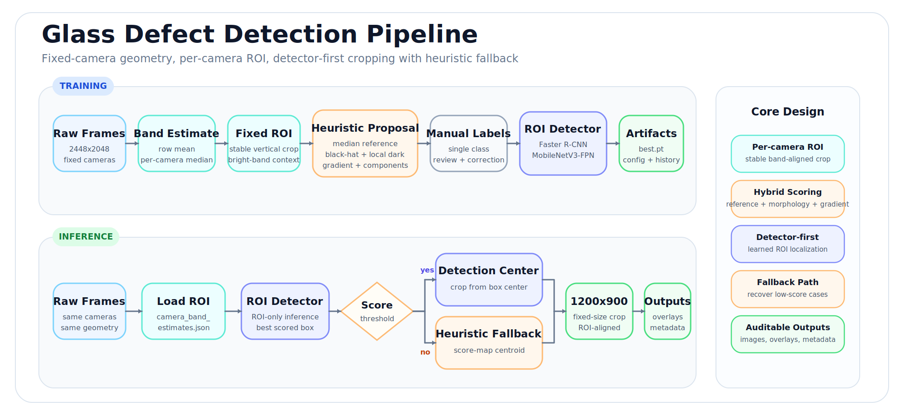
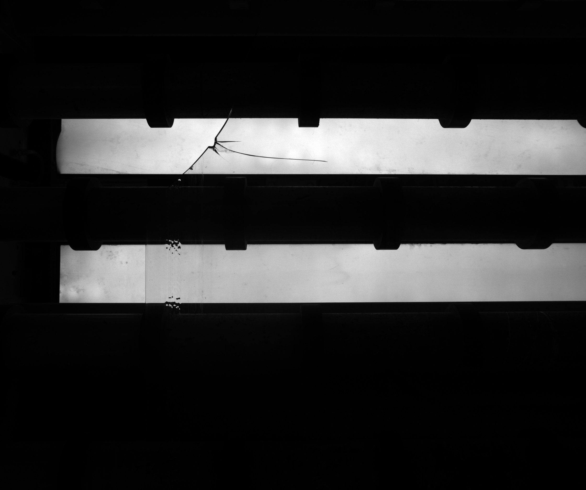
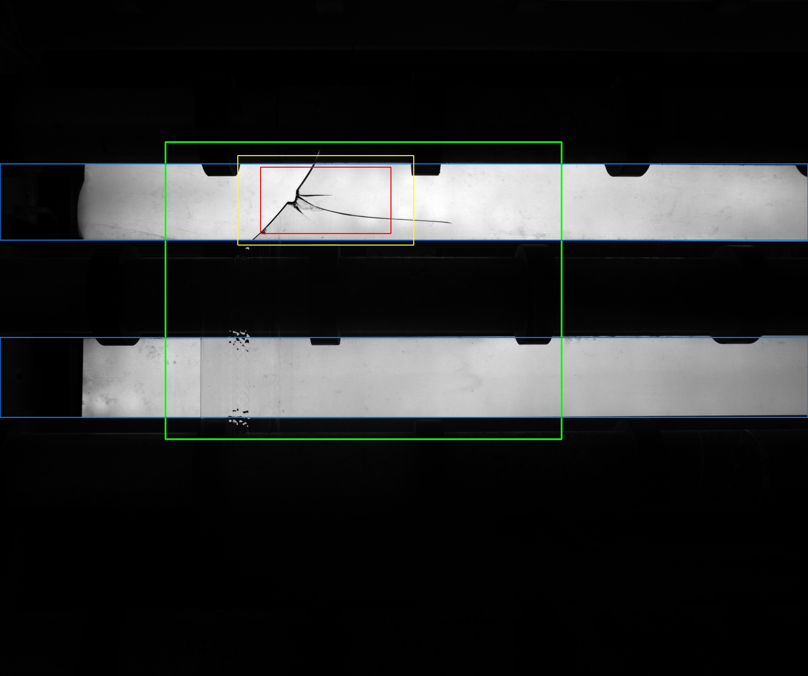
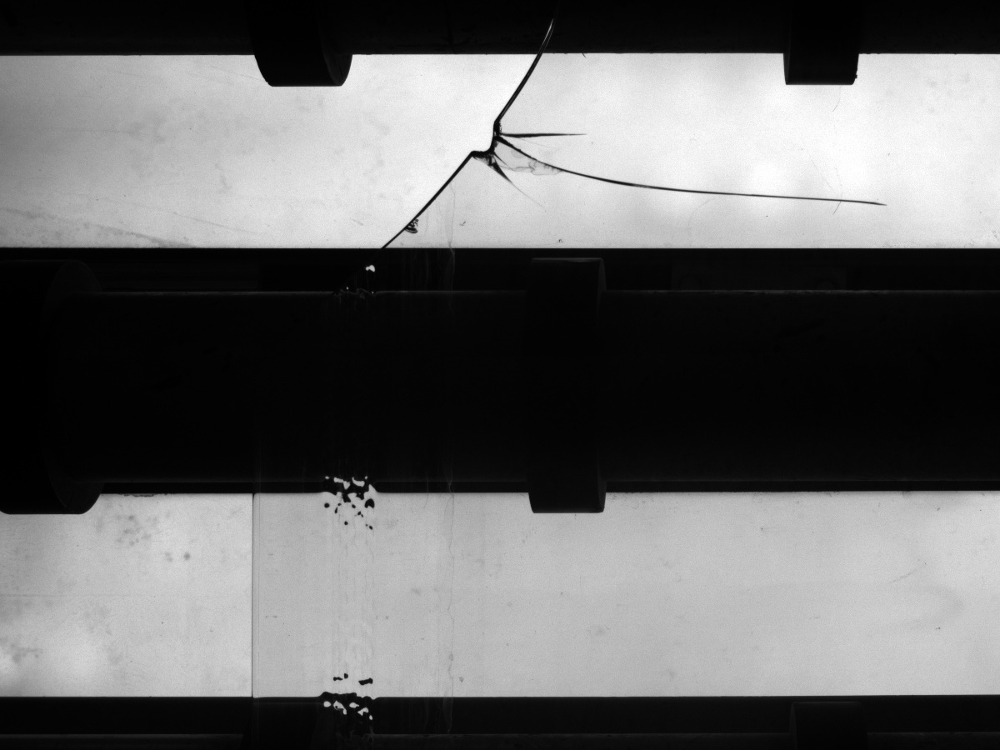

# Glass Defect Detection and Fixed-Size Cropping

---

This repository packages an end-to-end workflow for turning raw glass inspection images into fixed `1200x900` crops centered on defect regions.

The project was built for a specific production-style setting:

- Raw images are large, consistent, and camera-fixed.
- Each image contains two bright horizontal light bands.
- Defects usually appear inside or near that stable vertical region.
- The practical goal is not generic object detection. The goal is reliable, repeatable cropping around the defect area for downstream use.

If you have never seen this project before, the shortest summary is:

1. Use the stable camera geometry to lock the vertical crop region.
2. Create a small annotation batch from heuristic suggestions.
3. Manually correct those labels.
4. Train a single-class detector only on the relevant ROI.
5. Run final cropping with detector-first inference and heuristic fallback.

## Pipeline Overview

<p align="center">
  
</p>

## Visual Walkthrough

Read from left to right: the raw inspection image, the defect localization result, and the final fixed-size crop used by the pipeline.

<table>
  <tr>
    <td align="center"><strong>Origin</strong></td>
    <td align="center"><strong>Detect (bbox)</strong></td>
    <td align="center"><strong>Final crop</strong></td>
  </tr>
  <tr>
    <td align="center"></td>
    <td align="center"></td>
    <td align="center"></td>
  </tr>
  <tr>
    <td align="center"><sub>Raw 2448x2048 inspection frame</sub></td>
    <td align="center"><sub>Localization overlay</sub></td>
    <td align="center"><sub>Final 1200x900 crop</sub></td>
  </tr>
</table>


---

## What This Repository Contains

This open-source bundle includes the core assets needed to understand, reproduce, and extend the workflow:

- Pipeline scripts under `scripts/`
- A reviewed annotation batch under `data/annotation_batch_v1/`
- A trained detector checkpoint and training artifacts under `models/glass_detector_v1/`
- Formal-run metadata and sample outputs under `outputs/formal_run_v1/`
- Small raw-image examples under `examples/raw_samples/`

This bundle intentionally does **not** include:

- The full raw production dataset
- The full generated crop dataset
- Old smoke tests, audit rounds, and temporary experiment folders

---

## The Core Idea

This is a hybrid pipeline, not a pure detector-only project.

That design is intentional. The raw images come from fixed cameras, so the vertical structure is highly regular. A defect detector does not need to search the full `2448x2048` image. Instead, the pipeline first estimates the two bright bands for each camera and uses them to define a stable vertical ROI. The detector is then trained and run only inside that ROI.

This has two benefits:

- It reduces the search space and makes training easier.
- It preserves the bright-band context that is visually important for the crop.

At inference time, the final crop is chosen like this:

1. Use the trained detector to predict the defect location inside the ROI.
2. If a confident prediction exists, center the `1200x900` crop horizontally on that prediction.
3. If no prediction passes the score threshold, fall back to the heuristic cropper.

So the final system is detector-first, with a rule-based safety net.

---

## End-to-End Workflow

The repository supports two practical workflows:

- **Use the included checkpoint** if you want to reproduce final cropping quickly.
- **Rebuild the full pipeline** if you want to retrain or adapt the method to a new dataset.

### Workflow A: Run the Released Model

Use this path if you already have raw images in the same style and only want final `1200x900` crops.

1. Put the raw dataset under:

```text
data/raw_input/raw_data_glass_defect/
```

2. Run final cropping:

```powershell
python scripts/crop_with_glass_detector.py `
  --checkpoint .\models\glass_detector_v1\best.pt `
  --input-dir .\data\raw_input\raw_data_glass_defect `
  --output-dir .\outputs\formal_run_v1_generated
```

3. Inspect the generated results:

- **Cropped images:** `outputs/formal_run_v1_generated/images/`
- **Crop metadata:** `outputs/formal_run_v1_generated/crop_metadata.csv`
- **Optional debug overlays:** enable `--debug-overlays`

### Workflow B: Rebuild the Full Pipeline

Use this path if you want to retrain the detector, change thresholds, or port the method to a similar inspection task.

#### Step 1. Place the Raw Data

Put the full raw image folder at:

```text
data/raw_input/raw_data_glass_defect/
```

The scripts expect `.jpg` files and filenames similar to:

```text
cam-1_ts1763100100504.jpg
cam1_ts1763536491547.jpg
cam2_ts1764986728565.jpg
```

Camera names are parsed from the filename prefix, so keep that naming style.

#### Step 2. Run the Heuristic Baseline

This step is mainly for inspection and debugging. It estimates the bright-band region for each camera and proposes a crop using defect-like responses.

```powershell
python scripts/auto_crop_glass_defect.py `
  --input-dir .\data\raw_input\raw_data_glass_defect `
  --output-dir .\outputs\heuristic_baseline `
  --debug-overlays
```

Use this output to verify two things before training:

- The vertical ROI is aligned with the two bright bands.
- The candidate defect region is at least directionally correct.

#### Step 3. Build an Annotation Batch

This script samples images per camera, copies them into an annotation folder, and writes heuristic label suggestions where the confidence is high enough.

```powershell
python scripts/prepare_glass_detection_annotation.py `
  --input-dir .\data\raw_input\raw_data_glass_defect `
  --output-dir .\data\annotation_batch_v1 `
  --samples-per-camera 60
```

Generated files:

- **`data/annotation_batch_v1/images/`**: raw images to annotate
- **`data/annotation_batch_v1/labels/`**: YOLO-format labels
- **`data/annotation_batch_v1/overlays/`**: visual reference overlays
- **`data/annotation_batch_v1/manifest.csv`**: sampling and suggestion metadata

#### Step 4. Manually Correct the Labels

Review and correct the files under:

```text
data/annotation_batch_v1/labels/
```

The detector is trained on these corrected boxes, so this step matters. The project uses a single class: the defect region.

#### Step 5. Train the Detector

The training script crops each image to the fixed vertical ROI first, then trains a single-class detector on that ROI.

```powershell
python scripts/train_glass_defect_detector.py `
  --dataset-dir .\data\annotation_batch_v1 `
  --raw-dir .\data\raw_input\raw_data_glass_defect `
  --output-dir .\models\glass_detector_v1 `
  --epochs 20 `
  --batch-size 2 `
  --num-workers 0
```

Main outputs:

- `models/glass_detector_v1/best.pt`
- `models/glass_detector_v1/history.csv`
- `models/glass_detector_v1/summary.json`
- `models/glass_detector_v1/camera_band_estimates.json`

The included training summary reports a best validation F1 of about `0.531`. (treat that as a project snapshot, not a universal benchmark.)

#### Step 6. Run Final Cropping

After training, run the detector-driven cropper:

```powershell
python scripts/crop_with_glass_detector.py `
  --checkpoint .\models\glass_detector_v1\best.pt `
  --input-dir .\data\raw_input\raw_data_glass_defect `
  --output-dir .\outputs\formal_run_v1_generated
```

This script:

1. Loads the camera-specific band estimates saved during training.
2. Applies the detector inside the ROI.
3. Converts the best detection into a fixed `1200x900` crop.
4. Falls back to the heuristic cropper if detection confidence is too low.
5. Writes both images and metadata for later audit.

#### Step 7. Validate the Output

Check:

- `outputs/formal_run_v1_generated/images/`
- `outputs/formal_run_v1_generated/crop_metadata.csv`

Important metadata fields:

- **`source`**: whether the crop came from `model` or `heuristic`
- **`model_score`**: detector confidence when a model crop was used
- **`model_bbox_xywh`**: detector box in full-image coordinates
- **`heuristic_bbox_xywh`**: fallback candidate box when the heuristic path was used
- **`heuristic_trust`**: heuristic confidence score

For a quick visual reference, this repository also includes:

- `outputs/formal_run_v1/crop_metadata.csv`
- `outputs/formal_run_v1/sample_crops/`

---

## Repository Structure

```text
glass_defect_detection/
|-- README.md
|-- requirements.txt
|-- .gitignore
|-- .gitattributes
|-- docs/
|   |-- assets/
|   |   |-- pipeline-overview.svg
|   |   |-- origin_example.jpg
|   |   |-- detect_example.jpg
|   |   `-- final-crop_example.jpg
|   |-- PIPELINE.md
|   `-- PROJECT_LAYOUT.md
|-- scripts/
|   |-- auto_crop_glass_defect.py
|   |-- prepare_glass_detection_annotation.py
|   |-- train_glass_defect_detector.py
|   `-- crop_with_glass_detector.py
|-- data/
|   |-- raw_input/
|   |   `-- README.md
|   `-- annotation_batch_v1/
|       |-- README.txt
|       |-- PORTABILITY_NOTE.md
|       |-- dataset.yaml
|       |-- manifest.csv
|       |-- train.txt
|       |-- val.txt
|       |-- images/
|       |-- labels/
|       `-- overlays/
|-- models/
|   `-- glass_detector_v1/
|       |-- best.pt
|       |-- config.json
|       |-- camera_band_estimates.json
|       |-- history.csv
|       `-- summary.json
|-- outputs/
|   `-- formal_run_v1/
|       |-- README.md
|       |-- crop_metadata.csv
|       `-- sample_crops/
`-- examples/
    `-- raw_samples/
```

---

## Scripts and Their Roles

| Script | Role |
| --- | --- |
| `scripts/auto_crop_glass_defect.py` | Heuristic baseline cropper. Estimates bright-band ROI and proposes defect-centered crops. |
| `scripts/prepare_glass_detection_annotation.py` | Exports an annotation batch with heuristic suggestions for manual correction. |
| `scripts/train_glass_defect_detector.py` | Trains a single-class ROI detector from corrected labels. |
| `scripts/crop_with_glass_detector.py` | Runs final detector-based cropping with heuristic fallback. |

---

## Environment and Installation

Install dependencies from the repository root:

```powershell
pip install -r requirements.txt
```

Current requirements:

- `numpy`
- `opencv-python`
- `pillow`
- `torch`
- `torchvision`

---

## Included Artifacts and Portability Notes

Some files were adjusted so the repository can be moved and reused more easily:

- `data/annotation_batch_v1/train.txt`
- `data/annotation_batch_v1/val.txt`
- `data/annotation_batch_v1/dataset.yaml`

One file was kept mostly as a historical record:

- `data/annotation_batch_v1/manifest.csv`

That manifest may still contain absolute paths from the original workspace. See `data/annotation_batch_v1/PORTABILITY_NOTE.md` for the portability caveat and the files that were normalized for release.

---

## Limitations

- This project is designed for fixed-camera glass inspection images with stable band structure.
- It is not intended as a general-purpose defect detector for arbitrary viewpoints.
- The released checkpoint is useful for this data style, but it should not be assumed to generalize without revalidation.
- If detector recall is insufficient for a new camera or a new defect style, the most effective fix is usually more corrected labels, not more heuristic rules.

---

## License

This repository is released under the MIT License.

---

## Where To Read Next

- `docs/PIPELINE.md`: command-oriented walkthrough
- `docs/PROJECT_LAYOUT.md`: quick structure reference
- `outputs/formal_run_v1/README.md`: notes about the included formal-run artifacts
